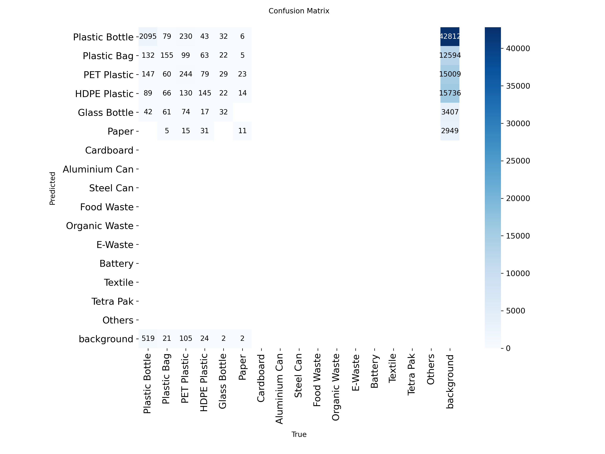
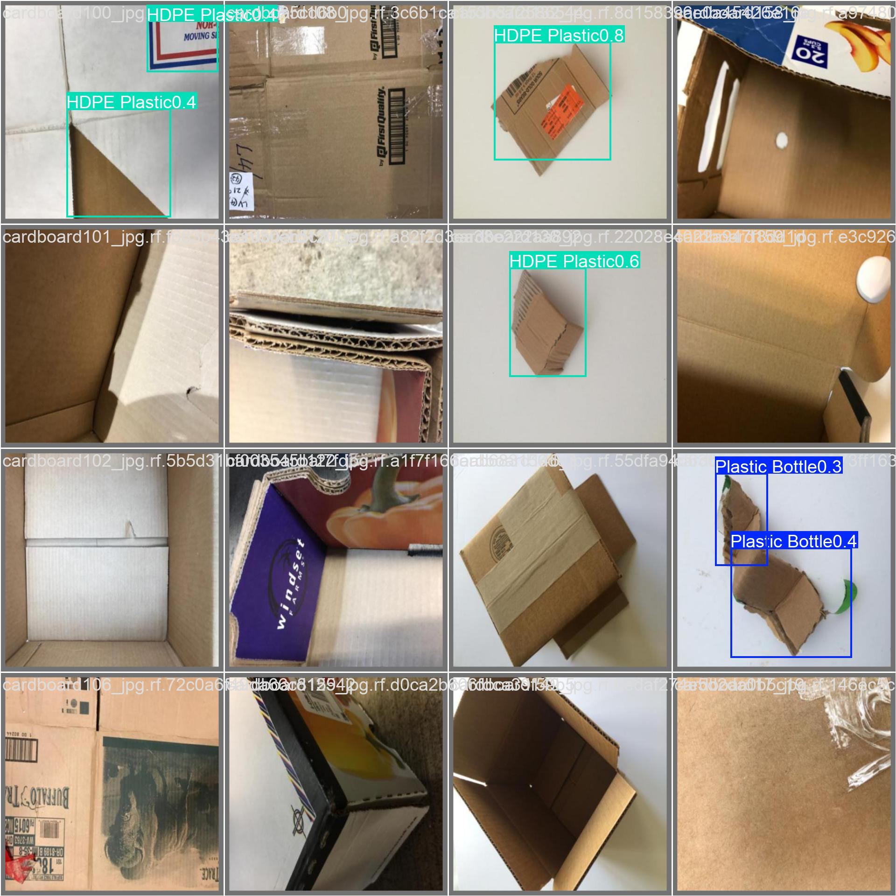

# SmartRecycle - AI-Based Waste Classification System

SmartRecycle is a B.Tech CSE minor project for the problem: **How can we easily classify wastes into recyclable and non-recyclable waste?** It combines a Next.js web interface, image upload and camera capture, YOLO object detection, explainable recycling guidance, history, analytics, feedback, and administrative review.

## 1. Project Overview

Waste is often sorted incorrectly because material types can look similar and users may not know how an item should be processed. SmartRecycle analyzes a waste image, detects waste objects, assigns a supported category, and presents a recyclable/non-recyclable decision with confidence, material information, contamination guidance, and recommendations. Users can inspect the image preview and bounding-box overlay, review previous classifications, and submit feedback when a prediction is incorrect.

## 2. Problem Statement

> How can we easily classify wastes into recyclable and non-recyclable waste?

Manual identification is time-consuming and difficult for mixed, contaminated, small, or visually similar waste. A computer-vision workflow can provide a consistent first decision and make the reasoning visible to the user.

## 3. Objectives

- Develop an easy-to-use waste image classification system.
- Identify waste objects from images.
- Classify waste into recyclable and non-recyclable categories.
- Provide AI confidence scores and visual detections where supported.
- Maintain classification history and waste analytics.
- Allow feedback on incorrect predictions.
- Provide admin review for questionable predictions.
- Create a foundation for improving the model using reviewed data.

## 4. Key Features

### Image Analyzer

- Image upload, drag and drop, and live camera capture.
- Image preview with YOLO bounding-box overlay.
- Waste detection, classification, confidence score, and analysis results.
- Explainable decision, material, contamination, cleaning, and recycling guidance.

### Dashboard

- Total predictions, average confidence, recyclable waste, and non-recyclable waste.
- Type of Waste Classified donut chart.
- Recent classifications and quick actions.

### Classification History

- Previous predictions with waste type, classification, confidence, material, contamination, and date.
- Expandable recommendations for each record.

### Waste Analytics

- Recyclable versus non-recyclable statistics.
- Waste type distribution and prediction trends exposed by the analytics API.
- Confidence analysis where available in the current dashboard.

### Admin Review

- Feedback statistics, common mistakes, confusing category pairs, and model reliability.
- User-corrected and low-confidence prediction review.
- Confirmed or corrected review status.

### Authentication

The current client-side flow is:

```text
Public Image Analyzer -> Dashboard button -> Login when unauthenticated
Login -> Dashboard
Dashboard -> Profile or Sidebar Logout -> session cleared -> Image Analyzer
```

The Dashboard is protected from unauthenticated browser sessions.

## 5. System Architecture

```text
User
  |
  v
Next.js App Router frontend
  |
  +--> Image Analyzer: upload, drag/drop, camera, preview
  |       |
  |       v
  |    POST /api/predict
  |       |
  |       v
  |    Python YOLO inference adapter
  |       |
  |       v
  |    detections, boxes, confidence, recycling metadata
  |
  +--> SQLite through Prisma: prediction history and feedback
  |
  +--> Dashboard, History, Analytics, and Admin Review API reads
```

## 6. Technology Stack

- **Frontend:** Next.js 16 App Router, React 19, TypeScript, Tailwind CSS 4.
- **Backend:** Next.js route handlers and server-side TypeScript modules.
- **AI/computer vision:** Ultralytics YOLO11 detection workflow, Python inference script, and exported `.pt`/`.onnx` model artifacts.
- **Database:** SQLite with Prisma 7 and `better-sqlite3` adapter.
- **UI and charts:** Lucide React, Radix UI slot, Recharts, React Hook Form, React Dropzone, and Sonner.
- **Tools:** npm, Git, GitHub, VS Code, and Python for dataset/model scripts.

## 7. AI / YOLO Model Details

The project contains a YOLO11 training and inference workflow. The API route calls `src/lib/yolo-model.ts`, which discovers the newest supported model from `models/` and `weights/`, writes the uploaded image to a temporary file, invokes `training/predict.py`, and converts returned objects into enriched application predictions. Each detection can include a label, confidence, normalized bounding box, material, recyclability, contamination, recommendation, and explanation.

The current training configuration is a 16-class detection dataset defined in `dataset/dataset.yaml`. The repository contains `models/best.pt` and `models/best.onnx`; the duplicate local `weights/` copies are intentionally excluded from the GitHub upload. The fallback adapter in `src/lib/inference-service.ts` remains available as a separate typed inference path, but the prediction API uses the YOLO adapter.

The recorded training run used 10 epochs. Actual output files are summarized in [docs/model-evaluation.md](docs/model-evaluation.md); no unverified performance claims are made here.

## 8. Waste Categories

The dataset configuration supports:

1. Plastic Bottle
2. Plastic Bag
3. PET Plastic
4. HDPE Plastic
5. Glass Bottle
6. Paper
7. Cardboard
8. Aluminium Can
9. Steel Can
10. Food Waste
11. Organic Waste
12. E-Waste
13. Battery
14. Textile
15. Tetra Pak
16. Others

The application metadata additionally provides recycling guidance for detected labels.

## 9. Project Structure

```text
SmartRecycle-Waste-Classification/
├── dataset/                 # YOLO configuration, documentation, and local dataset workspace
├── docs/                    # Results and model-evaluation notes
├── models/                  # Canonical exported model artifacts
├── prisma/                  # Schema and migrations
├── public/                  # Static assets
├── scripts/                 # Dataset preparation, validation, and statistics scripts
├── src/
│   ├── app/                 # Pages and API route handlers
│   ├── components/          # Analyzer, dashboard, admin, pickup, and UI components
│   ├── hooks/               # Client hooks such as waste classification
│   ├── lib/                 # Prisma, inference, API, auth, types, and server store
│   └── generated/           # Generated Prisma client (regenerated during setup)
├── training/                # YOLO train, validate, test, predict, and export scripts
├── .env.example
├── .gitignore
├── next.config.ts
├── package.json
├── package-lock.json
├── prisma.config.ts
└── tsconfig.json
```

## 10. Installation and Setup

### Prerequisites

- Node.js compatible with the installed Next.js 16 toolchain.
- npm (the repository includes `package-lock.json`).
- Python 3 with the packages required by the training/inference scripts and a working Python executable.
- A local SQLite database; Prisma uses `file:./dev.db` by default.

### Clone and install

```bash
git clone https://github.com/YOUR_GITHUB_USERNAME/SmartRecycle-Waste-Classification.git
cd SmartRecycle-Waste-Classification
npm install
```

### Environment variables

```bash
copy .env.example .env       # Windows
# cp .env.example .env       # macOS/Linux
```

- `DATABASE_URL` controls the Prisma datasource and defaults to `file:./dev.db`.
- `PYTHON_BIN` optionally selects the Python executable used for YOLO inference.
- `WASTE_MODEL_PATH` is an optional model-path hint used by the fallback inference service.

Never commit `.env`; use `.env.example` for placeholder names only.

### Database setup

```bash
npx prisma generate
npx prisma migrate dev
```

### Run the application

```bash
npm run dev
```

The development server opens the public Image Analyzer. The Dashboard button opens Login when no browser session exists.

### Production commands

```bash
npm run build
npm run start
```

## 11. How to Use the Application

1. Open SmartRecycle; the Image Analyzer is the public landing page.
2. Upload an image, drag and drop one, or use Live Camera.
3. Review the image preview and detected bounding boxes.
4. Run the analysis and inspect classification, confidence, material, and recycling guidance.
5. Submit feedback if the prediction is incorrect.
6. Select Dashboard and sign in when prompted.
7. Review Dashboard statistics, Classification History, Waste Analytics, and Admin Review.

## 12. Authentication Flow

```text
Logged out: Image Analyzer -> Dashboard -> Login -> successful login -> Dashboard
Logged in:  Image Analyzer -> Dashboard
Logout:     Dashboard -> Profile or Sidebar Logout -> cleared session -> Image Analyzer
```

The current implementation uses a browser auth-session flag and same-tab Next.js routing. It is suitable for the current minor-project demo flow and is not a substitute for production identity management.

## 13. Results and Outputs

The repository includes documentation of available local training outputs in [docs/model-evaluation.md](docs/model-evaluation.md). The captured YOLO result images are stored in [docs/screenshots](docs/screenshots) where present. No dashboard or UI screenshots were found in the original project, so none were fabricated.

### Available YOLO artifacts





The raw YOLO dataset is included through Git LFS so the repository remains self-contained for retraining. Generated label cache files and the `runs/` experiment-output tree are excluded.

## 14. Limitations

- Detection quality depends on training data, image quality, lighting, camera quality, and object visibility.
- Similar-looking or contaminated materials may be difficult to distinguish.
- Confidence is a model score, not a guarantee of correctness.
- The current browser auth flow is intentionally lightweight and should be replaced with a server-backed identity provider for production use.
- Raw training images are stored through Git LFS because of their size.

## 15. Future Enhancements

- Expand and diversify the training dataset.
- Improve difficult-category and contamination handling.
- Add real-time camera detection and a mobile application.
- Improve the human-feedback-to-annotation pipeline and automated retraining.
- Add richer analytics, multilingual guidance, and production-grade authentication.

## 16. Project Results Summary

The current project demonstrates AI-assisted waste image analysis, YOLO detection and bounding boxes, recyclable/non-recyclable classification, confidence scoring, prediction history, analytics, user feedback, admin review, and an authentication-protected dashboard.
